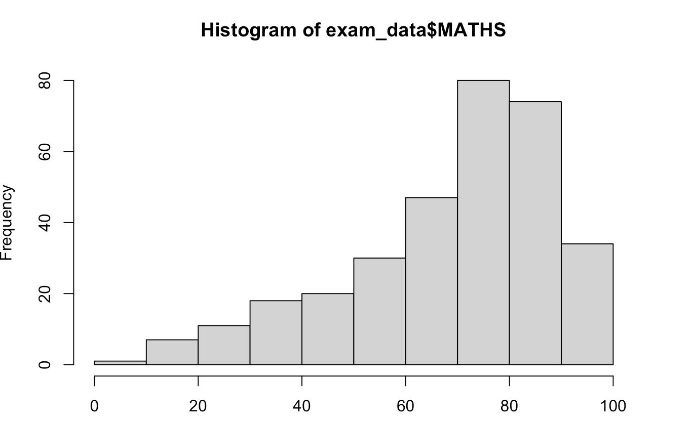

Hello I am Tran Thi Thanh Van, you can call me Haley.
Welcome to **ISSS608 Visual Analytics and Applications** homepage. In this website, you will find my coursework. Materials here are based on <a href="https://isss608-ay2025-26apr.netlify.app">https://isss608-ay2025-26apr.netlify.app</a> by Prof Kam Tin Seong from SMU.

# Hands On Exercise

<a href="Hands-on_Ex/Hands-on_Ex01/Hands-on_Ex01.html">

<h3>Hands-on Exercise 1 - A Layered Grammar of Graphics: ggplot2 methods</h3>

THI THANH VAN TRAN
APR 16, 2026

</a>

---
